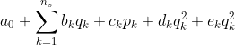

<!-- badges: start -->
[](https://app.codecov.io/gh/alexgenin/chouca?branch=master)
<!-- badges: end -->

# Chouca: a fast engine for probabilistic cellular automata 

[Probabilistic cellular automata](https://en.wikipedia.org/wiki/Stochastic_cellular_automaton) are a class of models that are based on a 2D grid of cells, each being in one of several discrete states. At each time step, those cells can 
transition from one state to another with a given probability. This probability typically
depends on the neighbors of the cell and the global state of the landscape. 

You probably already know Conway's game of life -- a probabilistic cellular automaton 
is identical, except that cell transitions do not always occur when a rule is satisfied, 
but with a given probability.

## What this package implements 

This package is an *engine* for probabilistic cellular automata (PCA). The goal is to 
provide a declarative interface to a PCA model, and leave the implementation details to 
the package. 

For example, Kubo's forest model (Kubo, 1996), which describes how gaps created by wind 
in a forest appear and expand, can be implemented using the following few lines 
of code: 

```r
kubo <- camodel( 
  transition(from = "TREE", 
             to   = "EMPTY", 
             prob = ~ d + delta * q["EMPTY"] ), 
  transition(from = "EMPTY", 
             to   = "TREE", 
             prob = ~ alpha * p["TREE"]), 
  parms = list(d = 0.125, 
               delta = 0.5, 
               alpha = 0.1), 
  all_states = c("EMPTY", "TREE")
)
```

Running the model for 200 iterations on a 100x100 grid is another couple of lines: 

```r
initmat <- generate_initmat(kubo, c(0.5, 0.5), nr = 100, nc = 100)
run_camodel(kubo, initmat, niter = 200)
```

At the moment `chouca` only runs cellular automata for which the transition probabilities are second degree polynomial of the global covers of each state `p` and the local covers of each state `q`. In other words a transition rule must follow the following pattern: 



where `q_k` is the proportion of neighbors of a cell in state `k` and `p_k` is the 
proportion of cells in a given state over the whole 2D grid. `a_0` and the `b_k`, `c_k`, 
`d_k` and `e_k` must be constants. 


## Motivation and objectives

Probabilistic cellular automata are widely used in ecology to describe the dynamics of 
organisms in the landscape, and investigate how local interactions between organisms may 
affect the dynamic of a system as a whole. However, implementing them is often done using 
ad-hoc R code, which is slow and error-prone. `chouca` aims at providing a high-level 
interface to such type of models, in order to reduce errors, and allow spending more time 
on model design, than debugging ugly code. 

`chouca` wants to be user-friendly, yet provide very good performance. Several engines are 
included, including a pure-R engine and a C++ engine. In addition to those two, `chouca` 
is capable of emitting and compiling the required C++ code at runtime for a specific 
model. This allows making optimizations that would be impossible otherwise, and improves 
performance typically by one or two orders of magnitude.


## Authors and acknowledgements 

`chouca` is mainly developed by Alexandre Génin, but contributions and discussion are 
welcome. 

*A.G. has received funding from the European Union’s Horizon 2020 research and innovation programme under the Marie Sklodowska-Curie grant agreement N°896159.*


## References 

Kubo, Takuya, Yoh Iwasa, and Naoki Furumoto. 1996. “Forest Spatial Dynamics with Gap Expansion: Total Gap Area and Gap Size Distribution.” Journal of Theoretical Biology 180 (3): 229–46.
