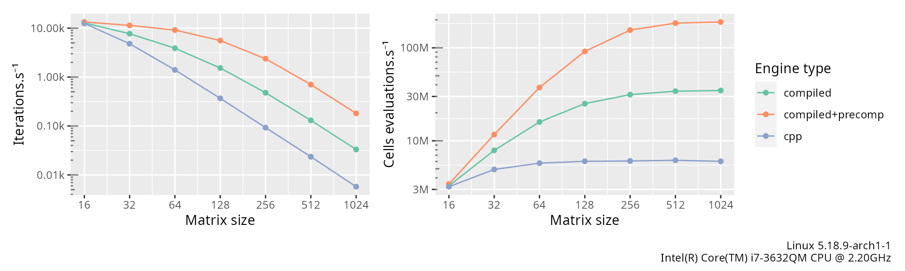

<!-- badges: start -->
[](https://app.codecov.io/gh/alexgenin/chouca?branch=master)
[](https://github.com/alexgenin/chouca/actions/workflows/R-CMD-check.yaml)
<!-- badges: end -->

# Chouca: a fast engine for stochastic cellular automata

[Stochastic cellular automata](https://en.wikipedia.org/wiki/Stochastic_cellular_automaton)
are models that are based on a 2D grid of cells, each cell being in one of
several discrete states. At each time step, those cells can transition from
one state to another with a given probability. This probability typically
depends on the neighbors of the cell and the global state of the landscape.

You probably already know Conway's game of life -- a stochastic cellular
automaton is the same, except that cell transitions do not always occur when
a rule is satisfied, but with a given probability. It typically looks like this:


## What this package implements

This package is an *engine* for stochastic cellular automata (SCA), although
it can also run deterministic cellular automata. The objective is to provide
a high-level, declarative interface to an SCA model, and leave the implementation 
details to the package.

For example, Kubo's forest model (Kubo, 1996), which describes how gaps created
by wind in a forest appear and expand, can be implemented using the following
few lines of code:

```r
kubo <- camodel(
  transition(from = "TREE",
             to   = "EMPTY",
             prob = ~ d + delta * q["EMPTY"] ),
  transition(from = "EMPTY",
             to   = "TREE",
             prob = ~ alpha * p["TREE"]),
  parms = list(d = 0.125,
               delta = 0.1,
               alpha = 0.25),
  wrap = TRUE,
  neighbors = 4,
  all_states = c("EMPTY", "TREE")
)
```

Running the model for 200 iterations on a 100x100 grid is another couple of lines:

```r
initmat <- generate_initmat(kubo, c(TREE = 0.5, EMPTY = 0.5), nrow = 100, nc = 100)
run_camodel(kubo, initmat, times = seq(0, 200))
```

`chouca` can display results as they are being simulated, making visual
explorations easier:

```r
options <- list(custom_output_fun = landscape_plotter(kubo, fps_cap = 24))

run_camodel(kubo, initmat, times = seq(0, 200), control = options)
```


## Motivation and objectives

Stochastic cellular automata are widely used in ecology to describe the dynamics of
organisms over space, and investigate how their interactions may affect the dynamic
of the system as a whole. However, implementing those models is often done using ad-hoc
R code, which is slow, error-prone, and does not encourage exploring different
variations around a single model. `chouca` provides a high-level interface to
such type of models, in order to reduce errors, and spend more time on model design,
rather than debugging ugly code.

`chouca` wants to be user-friendly, yet provide very good performance.
Several backend are provided, the main one being in C++. `chouca` can also
emit and compile the required C++ code at runtime for a specific model. This
allows making optimizations that would be impossible otherwise, and improves
performance typically one or two orders of magnitude.

Here are a few graphs that should help you judge what performance to expect from
`chouca`. These curves represent the average performance across a few models
taken from the literature:




## Installation

`chouca` can be installed with the devtools `package` directly from github:

```r
devtools::install_github("alexgenin/chouca")
```


## Authors and acknowledgements

`chouca` is mainly developed by Alexandre Génin, but contributions and
discussion are of course welcome!

*This work has received funding from the European Union’s Horizon 2020 research and innovation programme under the Marie Sklodowska-Curie grant agreement N°896159.*

