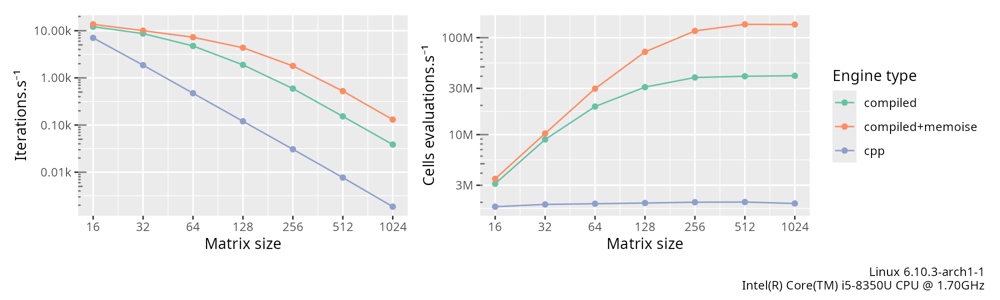

<!-- badges: start -->
[](https://app.codecov.io/gh/alexgenin/chouca?branch=master)
[](https://github.com/alexgenin/chouca/actions/workflows/R-CMD-check.yaml)
<!-- badges: end -->

# Chouca: a fast engine for probabilistic cellular automata 

[Probabilistic cellular automata](https://en.wikipedia.org/wiki/Stochastic_cellular_automaton) are a class of models that are based on a 2D grid of cells, each being in one of several discrete states. At each time step, those cells can 
transition from one state to another with a given probability. This probability typically
depends on the neighbors of the cell and the global state of the landscape. 

You probably already know Conway's game of life -- a probabilistic cellular automaton 
is identical, except that cell transitions do not always occur when a rule is satisfied, 
but with a given probability.

**`chouca`** is still in development, and interfaces are still unstable. If you use it 
for your own work, expect breaking changes.

## What this package implements 

This package is an *engine* for probabilistic cellular automata (PCA), although it can 
also do deterministic cellular automata. The objective is to provide a high-level, 
declarative interface to a PCA model, and leave the implementation details to the 
package. 

For example, Kubo's forest model (Kubo, 1996), which describes how gaps created by wind 
in a forest appear and expand, can be implemented using the following few lines 
of code: 

```r
kubo <- camodel( 
  transition(from = "TREE", 
             to   = "EMPTY", 
             prob = ~ d + delta * q["EMPTY"] ), 
  transition(from = "EMPTY", 
             to   = "TREE", 
             prob = ~ alpha * p["TREE"]), 
  parms = list(d = 0.125, 
               delta = 0.5, 
               alpha = 0.1), 
  wrap = TRUE, 
  neighbors = 4, 
  all_states = c("EMPTY", "TREE")
)
```

Running the model for 200 iterations on a 100x100 grid is another couple of lines: 

```r
initmat <- generate_initmat(kubo, c(TREE = 0.5, EMPTY = 0.5), nr = 100, nc = 100)
run_camodel(kubo, initmat, times = seq(0, 200))
```

Conway's game of life can be declared in the following way. Note that we declare that 
we want the model with 8 neighbors, and with a toric space (that wraps around the 
edges):

```r
  mod <- camodel( 
    transition("LIVE", "DEAD", ~ q["LIVE"] < (2/8) | q["LIVE"] > (3/8)), 
    transition("DEAD", "LIVE", ~ q["LIVE"] == (3/8)), 
    wrap = TRUE, 
    neighbors = 8, 
    all_states = c("DEAD", "LIVE")
  )
```

Many models are supported by `chouca`: any neighborhood rule can be used, and rules 
depending on the global cover of a state can be included as long as it can be 
expressed as a polynomial of that state. If you don't if your model is supported or not, 
you can always write it: `chouca` will warn you if it cannot use your transition rules
accurately. 

## Motivation and objectives

Probabilistic cellular automata are widely used in ecology to describe the dynamics of 
organisms in the landscape, and investigate how local interactions between organisms may 
affect the dynamic of a system as a whole. However, implementing those models is often 
done using ad-hoc R code, which is slow, error-prone, and does not encourage exploring 
different variation around a single model. `chouca` aims at providing a high-level 
interface to such type of models, in order to reduce errors, and allow spending more time 
on model design, than debugging ugly code. 

`chouca` wants to be user-friendly, yet provide very good performance. Several engines are 
included, including a pure-R engine and a C++ engine. In addition to those two, `chouca` 
is capable of emitting and compiling the required C++ code at runtime for a specific 
model. This allows making optimizations that would be impossible otherwise, and improves 
performance typically by one or two orders of magnitude.


## Benchmarks

Here are a few graphs that should help you judge what performance to expect from 
`chouca`. These curves represent the average performance across a few models taken from 
the literature: 




## Authors and acknowledgements 

`chouca` is mainly developed by Alexandre Génin, but contributions and discussion are 
welcome. 

*This work has received funding from the European Union’s Horizon 2020 research and innovation programme under the Marie Sklodowska-Curie grant agreement N°896159.*


## References 

Kubo, Takuya, Yoh Iwasa, and Naoki Furumoto. 1996. “Forest Spatial Dynamics with Gap Expansion: Total Gap Area and Gap Size Distribution.” Journal of Theoretical Biology 180 (3): 229–46.
