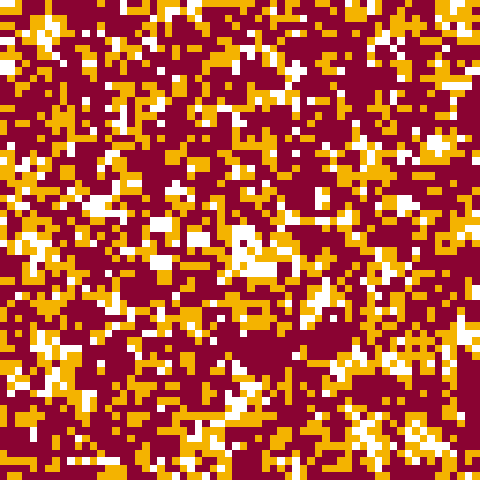
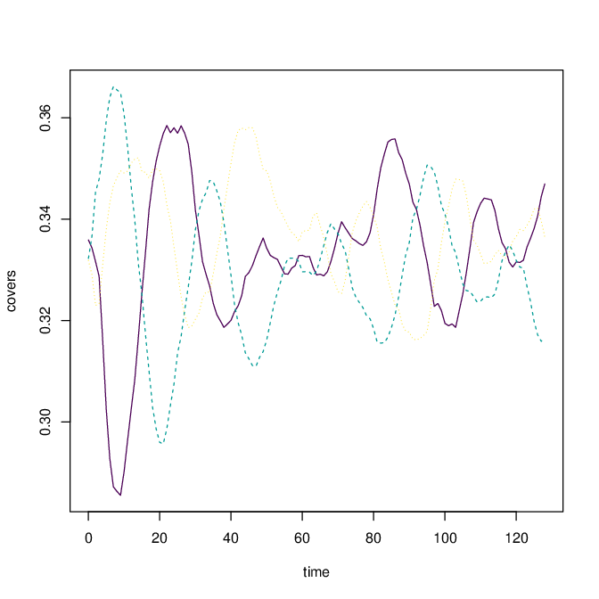

```{r, echo = FALSE}
knitr::opts_chunk$set(
  fig.align = "center", 
  fig.width = 7, 
  fig.height = 7
)
```

```{css, echo = FALSE}
img { 
  max-width:100%; 
}
```


```{r, echo = FALSE, results = FALSE, warning = FALSE, message = FALSE}
library(chouca)
library(plyr)
library(ggplot2)
```

`chouca` is engine in R for
[stochastic cellular automata](https://en.wikipedia.org/wiki/Stochastic_cellular_automaton),
which are models that describes the temporal dynamics of a 2D grid made
of cells. Each cell can be in one of a finite number of states, and switch
states over time with probabilities that depend on their neighborhood.

A picture being worth a thousand words, the output of a stochastic cellular
automaton looks like the following image in practice:



(NOTE: Please see animated version <a href="https://alex.lecairn.org/files/chouca_sca_gifcreate.mp4">there</a>).

Stochastic cellular automata are widely used to describe the dynamics of
landscapes, for example, forests or corals growing over space. Yet, implementations 
are often ad-hoc, and done by the authors themselves, which is prone to bugs and often 
leads to slow implementations. `chouca` tries to avoid this by providing a common base 
onto which such models can be built. The goal is for the user to declare the 
probabilities of state transitions of the model, then `chouca` handles the rest.

`chouca` supports a wide selection of models, while preserving decent performance.
This is done by writing most of the code in C++, and being able to emit and
compile C++ code on the fly for a specific model at run time. This enables
compiler optimizations that would be impossible with pre-compiled code, and
often improves simulation speed by one or two orders of magnitude. `chouca` can
also use a memoisation-based strategy to run simulations, in which probabilities
are not recomputed for each cell at each iteration, providing another boost in
performance. For supported models, `chouca` can be 3 to 4 orders of magnitude
faster than common implementations.

While `chouca` is built mainly for stochastic cellular automata, it can also
handle non-stochastic cellular automata, such as Conway's Game of Life or the
[rock-paper-scissor automaton](https://www.youtube.com/watch?v=TvZI6Xc0J1Y). This is 
because a deterministic cellular automaton is simply a stochastic celular automata in 
which transition probabilities are always ones or zero.

## Your first model in `chouca`

To give you an idea on how `chouca` works, let's implement a small forest gap model 
(Kubo et al. 1996). In such model, cells can be either 'empty', or filled with a tree, 
what we call here the 'forest' state. Trees produce seeds that can fly over the whole
landscape and land haphazardly in any cell. Thus, the probability of an empty cell to 
switch to the forested state is proportional to $p_+$, the proportion of cells with
trees in the landscape. If we represent the empty state as $0$ and the forest
state as $+$, this probability of transition is thus:

$$P(0 \rightarrow +) = \alpha p_{+}$$

where $\alpha$ is the rate at which seeds are produced by each tree.

Trees naturally die over time, and because wind bursts are stronger in empty areas, 
trees have a higher probability of dying when they have empty neighboring cells:

$$P(+ \rightarrow 0) = \delta_0 + \delta q_{empty}$$

Here, $q_{empty}$ denotes the proportion of cells around the focal cell that
are empty, i.e. in the "empty" state. $q_{empty}$ is equal to one when a cell
has all of its neighbors in the empty state, and zero when none of the
neighbors is in this state.

This model has three parameters, $\alpha$, $\delta_0$ and $\delta$, and can be
defined in `chouca` using the following syntax:
```{r example_mod_def}
kubo_model <- camodel(
  transition(from = "0",  to = "+", ~ alpha * p["+"]),         # reproduction of trees
  transition(from = "+", to = "0", ~ delta0 + delta * q["0"]), # death 
  parms = list(alpha = 0.6, delta0 = 0.05, delta = 0.4),
  wrap = TRUE,
  neighbors = 8
)
```

We first declare two transitions, including the states between which they occur,
and an expression describing how to compute the probability. In that expression,
`p` refers to the proportions of cells of the landscape in each state, and `q`
refers to the the proportion of neighbors in each state. `q["+"]` for example
represents the proportion of neighbors of a cell in the `+` state (forest), which is a
number between 0 and 1.

We then set the argument `parms` to a list containing the numerical values of
the model parameters. We use the argument `wrap = TRUE` to state that the model
will be run on a space in which the edges "wrap around", and the first
column/top row of the landscape is neighboring the rightmost/bottom column (a
toric space). We use the argument `neighbors = 8` to state that we want to
consider all 8 neighbors of a cell, i.e. including those that are diagonal.
This type of neighborhood is referred to as the
[Moore](https://en.wikipedia.org/wiki/Moore_neighborhood) neighborhood, the
other supported type being a 4-way (or Von-Neumann) neighborhood.

A summary of the model can be printed on the R command line, that recalls the
model definition and options.

```{r}
kubo_model
```

You can also plot the model structure (the states and the transitions) as a graph, using 
the generic function `plot()`: 

```{r}
plot(kubo_model)
```

The next step is to define the initial landscape from which we want to start the
simulation. We can do so by using the function `generate_initmat`:

```{r initmat}
init_mat <- generate_initmat(kubo_model, 
                             pvec = c(0.5, 0.5),
                             nr = 128, nc = 256)
```

Here we initalize the covers to half forest and half empty space using the
argument `pvec`, and use a landscape of 128 rows by 256 columns filled at random. We 
can now run the simulation:

```{r run}
out <- run_camodel(kubo_model, init_mat, times = seq(0, 100))
```

We can then display the results, either in the R console using `summary()`, as a plot
using the generic function `plot()`, which displays the global covers of each state
through time, or `image()`, which displays the landscape:

```{r display_console}
summary(out)
```

```{r display_plot, fig.width = 12, fig.height = 6}

oldpar <- par(mfrow = c(1, 2))
plot(out)
title("Global covers over time")
image(out)

# Restore graphical parameters
par(oldpar)
```


## Supported models

`chouca` works only with models that use either a 4x4 or 8x8 neighborhood
(von Neumann or Moore neighborhood, respectively), and in which the effects
are isotropic, i.e. all neighbors have a similar effect regardless of whether
they are above, or below a given cell. Cellular automata that involve a
preferencial direction cannot be implemented in `chouca`, for example with
water running downslope in a landscape (Mayor et al. 2013).

The probabilities of transition can have any form, but respecting those two
principles will work better:

* To be accurately computed, transition probabilities must be a linear
polynomial of the products of the local or global proportion of cells in a
given state. For example, a transition probability defined between states $i$
and $j$ as $P(i \rightarrow j) = 0.1 + p_i + p_j q_i$ works perfectly, but
something involving non-linear functions such as
$P(0 \rightarrow +) = 0.1 + sin(p_i)$ may not be correctly handled (see below
for the consequences).

* There is some tolerance is discontinuities in the transition rules. Rules
such as "if one neighbor is in state $i$, then the probability of transition
is increased" are OK. However, such rule involving multiple types of neighbors
are not, e.g. "if one neighbor is in state $i$ *and* another one in state
$j$, then...". This type of discontinuity will lead to approximations in
transition probabilities.

Overall, the assumed functional form of transitions probabilities must be the following:

$$
P( a \rightarrow b ) = \beta_0 + 
  \sum_{s \in S} f_s(q_s) + 
  \zeta(\boldsymbol p, \boldsymbol p) + 
  \zeta(\boldsymbol p, \boldsymbol q) + 
  \zeta(\boldsymbol q, \boldsymbol q) 
$$

where $S$ represents the set of states of the cellular automaton, $f_s$ can be any
function of $q_s$. $\zeta(\boldsymbol x, \boldsymbol y)$ is, for two vectors of 
length $n$ $\boldsymbol x = (x_1, x_2, ..., x_n)$ and 
$\boldsymbol y = (y_1, y_2, ..., y_n)$, the sum of $K$ terms 
$$
 \zeta(\boldsymbol x, \boldsymbol y) = \beta_1 x_1^{a_0} x_2^{b_0} + 
   \beta_2 x_2^{a_1} x_1^{b_1} + 
   \beta_3 x_3^{a_2} x_1^{b_1} + 
   ...
   \beta_K x_n^{a_K} x_1^{b_K} 
$$

All the $(\beta_i)_{i \in [1:K]}$, $(a)_{i \in [1:K]}$, $(b)_{i \in [1:K]}$ 
are constant model parameters. Many models can be represented using this functional 
form - however, this may not always be the case, especially as soon as non-linear
functions are involved (exp, sin, etc.), or functions with discontinuities. This
functional form looks daunting, but `chouca` will warn you if the transition
probabilities cannot be accurately computed, so the best way to go is probably to write
your model and see if it is supported.

For all models, `chouca` reports an estimation of the error on the probabilities of
transition, and whether probabilities can reach problematic values above one 
or below zero. For example, the above forest model can be perfectly represented by
`chouca`, so the reported error is zero:

```{r}
print(kubo_model)
```

The following model, which includes an exponential function of the neighborhood, has a
non-zero error, because this exponential function cannot be perfectly approximated by
a polynomial:

```{r}
mod <- camodel(
  transition(from = "dead", to = "live", ~ 0.1 + exp(0.2 * q["dead"] + p["dead"])),
  transition(from = "live", to = "dead", ~ 0.1),
  wrap = TRUE,
  neighbors = 8
)
print(mod)
```

The reported maximum absolute error on the probability of transitions is `r format(max(mod$max_error), digits = 2)`, which is very small. The relative maximum
error, in other words the error in percentage of the exact probability, is also
very small (`r format(max(mod$max_rel_error), digits = 2)`). Because both these
probabilities are very small, you are probably safe to run this model in `chouca` and
obtain correct results, despite the fact that it does not follow the ideal form.

The following model gives more trouble:

```{r}
mod <- camodel(transition(from = "dead", to = "live",
                          ~ 0.1 + sin(pi * q["dead"] * p["dead"] )),
               transition(from = "live", to = "dead",
                          ~ 0.1),
               wrap = TRUE,
               neighbors = 8)
print(mod)
```

Here, both the absolute and relative errors on the computed probabilities are
non-negligible (`r format(max(mod$max_error), digits = 2)` and
`r format(max(mod$max_rel_error), digits = 2)`). A warning is produced,
and the problematic transition is pointed out. You should probably revise this model
if you want to make it work with `chouca`. A possible approach is to approximate
the function by a taylor expansion of $sin$, for example using the expansion in zero:
$sin(x) \approx x - \frac{x^3}{3!} + \frac{x^5}{5!}$.

```{r}

sin_approx <- function(x) {
  x - x^3/factorial(3) + x^5/factorial(5)
}

mod <- camodel(transition(from = "dead", to = "live",
                          ~ 0.1 + sin_approx(pi * q["dead"] * p["dead"]) ),
               transition(from = "live", to = "dead",
                          ~ 0.1),
               wrap = TRUE,
               neighbors = 8)
print(mod) # negligible error this time, as we use an approximation of sin()

```


## Performance

One of the main appeal of `chouca` is its performance: which is affected by
various factors. The main one is the model complexity. Using a model with
transition probabilities that are complicated products of global or neighbor
covers, or that do not fit well the expected functional form will lead to poor
performance. When possible, try to make your model follow this form. That being said, 
several approaches exist to improve simulation speed, regardless of the model: (i) 
on-the-fly compilation, (ii) memoisation of transition probabilities and (iii) multithreading.

On-the-fly compilation can be enabled using the "compiled" engine to run the cellular
automaton. This is done by setting the `engine` control argument to the string 
"compiled":

```{r}
control_args <- list(engine = "compiled",
                     precompute_probas = FALSE) # see below for meaning of this parameter

out <- run_camodel(kubo_model,
                   initmat = init_mat,
                   times = seq(0, 512),
                   control = control_args)
```

On first run, this model will take a few extra seconds to run as the C++
code corresponding to the model needs to be compiled. However, the simulation
itself will be much faster. Compilation only needs to be done when the
structure of the model or the size of the landscape changes. A simple change
in parameter value will not trigger a new compilation, except when the
probabilities of transition can be simplified, for example when a parameter
is set to zero. 

Another approach to better performance lies in the precomputation of
probabilities. The naive approach to run a CA is to consider each cell in
the landscape one by one, and compute its probability of transition to every
state it could switch to. This may entail a lot of repeated computations, as
many cells will have the same neighborhood configurations. To avoid this, we
can compute the probabilities of transition for every neighborhood
configuration, and just look the number up to know whether cells switch or not.
This approach is enabled by using the argument `precompute_probas` in the
control list:

```{r}

control_args <- list(engine = "compiled",
                     precompute_probas = TRUE,
                     console_output_every = 128) # report less often on console

out <- run_camodel(kubo_model,
                   initmat = init_mat,
                   times = seq(0, 512),
                   control = control_args)

```

This can dramatically improve the performance for models that have a
small number of states and simple transition rules. However, it may be
counter-productive for models with a larger number of states, as the number of
neighborhood configurations grows very quickly with the number of different
model states ($S^4$ or $S^8$ for $S$ states, depending on the type of
neighborhood). By default, a simple heuristic is used to make a decent choice.

The last approach to improve performance is to use multithreading. In `chouca`,
the approach used considers the updating of cells in parallel, instead of
doing it one-by-one. However, there is some synchronisation work required
between threads to make sure the different cores are not writing to shared
data structures. This often results in a significant overhead, and thus only
small performance improvements when using memoisation. 

```{r}

control_args <- list(engine = "compiled",
                     precompute_probas = TRUE,
                     cores = 2,
                     console_output_every = 128)

out <- run_camodel(kubo_model,
                   initmat = init_mat,
                   times = seq(0, 512),
                   control = control_args)

```

Future improvements of the package may improve this situation. In the
meantime, if you happen to be running several simulations at the same time
(which is often the case), you are probably better off parallelizing at a
higher level. Note that if you are *not* using memoisation 
(`precompute_probas = FALSE`), then using multiple cores can be an interesting strategy. 

Finally, because the model code is compiled on the fly, you may be able to use
optimizations that are specific to your combination of platform and compiler.
The best way to do so is to edit your platform `~/.R/Makevars` file to add the
flags you want, such as `CXXFLAGS=-O3 -march=native -mtune=native`. However,
do not expect too much as most of the time this does not bring much more
performance to the table.


## Storing/discarding/accessing data

Various options are available to access simulation outputs. When nothing is
specified, the percentage of cells in each state will be saved at each time
step specified in the `times` vector (argument to `run_camodel()`), and the
landscape at the first and last time step will be saved. These can be
accessed by extracting elements from the object returned by `run_camodel()`.

Global covers are saved as a matrix whose first column is the time, and the
others are the percentages of cells in each state:

```{r}

init <- generate_initmat(kubo_model, c(0.5, 0.5),
                         nr = 128)

run <- run_camodel(kubo_model, init, times = seq(0, 128, by = 1))

# Extract covers and display the last lines of the table
covers <- run[["output"]][["covers"]]
tail(covers)
```

The landscape are also available, using a similar syntax. A nifty function to
display landscapes is available in the `spatialwarnings` package,
`display_matrix()`:

```{r}
landscapes <- run[["output"]][["snapshots"]]
spatialwarnings::display_matrix(landscapes)
```

Sometimes, we do not want to store everything at all time steps. One option to
reduce output is to specify a different `times` vector to `run_camodel()`.
This will not affect the precision of the simulation, but will simply change
the points in time for which simulation output is saved.

```{r}
# Save every eight iterations
run2 <- run_camodel(kubo_model, init, times = seq(0, 128, by = 8))
covers2 <- run2[["output"]][["covers"]]
tail(covers2)

plot(covers[ ,"t"], covers[ ,"+"], type = "l", col = "red")
lines(covers2[ ,"t"], covers2[ ,"+"], col = "blue")
```

Another option is to set the control argument `save_covers_every` to something
higher than one. This will only save simulation output at time points that
are multiple of this value:

```{r}
ctrl <- list(save_covers_every = 8)
run3 <- run_camodel(kubo_model, init, times = seq(0, 128, by = 1),
                    control = ctrl)
covers3 <- run3[["output"]][["covers"]]
tail(covers3)

plot(covers[ ,"t"], covers[ ,"+"], type = "b", col = "red",
     xlab = "t", ylab = "forest c over")
lines(covers2[ ,"t"], covers2[ ,"+"], col = "blue")
points(covers2[ ,"t"], covers2[ ,"+"], col = "blue")
lines(covers3[ ,"t"], covers3[ ,"+"], col = "darkgreen")
points(covers3[ ,"t"], covers3[ ,"+"], col = "darkgreen")
legend(x = "right",
       legend = c("original", "reduced 'times' vector", "using 'save_covers_every'"),
       col = c("red", "blue", "darkgreen"),
       lty = c(1, 1, 1))

```

A similar argument exists for saving landscapes, `save_snapshots_every`, to
reduce or increase the number of landscapes being saved during the simulation,
with similar effects.

## Running computations on the fly

### Computing things

One of the easiest way to dissect the results of your simulation is simply to store the 
landscape, or the covers of each state as the simulation runs, then do what you want with 
them afterwards. This is not always possible, however, as the landscapes may be large and 
not that many may fit in your computer's memory, or your model may be running for a large 
number of iterations. To avoid this, `chouca` can take a special function that will be 
executed as the simulation is running.

This function must have a specific form: its first argument should be `t`,
the current time of the simulation (an integer), and the second should be 
`mat`, the current landscape (a `matrix` object containing the levels of a factor). 

For example, we can compute how the spatial autocorrelation changes in the
landscape as the simulation is running, measured by the Moran's I index
(available in package [spatialwarnings](https://cran.r-project.org/package=spatialwarnings):

```{r}

mod <- ca_library("forestgap")
init <- generate_initmat(mod, c(TREE = .5, EMPTY = .5), nr = 256)

# Define the function that computes AC at lag-1 using Moran's I
compute_aclag1 <- function(t, mat) {
  m <- matrix(mat == "TREE", nrow = nrow(mat), ncol = ncol(mat))
  data.frame(t = t, ac = spatialwarnings::raw_moran(mat))
}

control_args <- list(save_covers_every = 0,
                     custom_output_every = 1,
                     custom_output_fun = compute_aclag1)

out <- run_camodel(mod, init, times = seq(0, 64), control = control_args)

```

The results can be extracted as follows:

```{r}
my_output <- out[["output"]][["custom"]]
```

By default, all custom outputs are stored in a list, so a common operation is
to transform it into a table using `rbind` or any other function:

```{r}
my_tbl <- do.call(rbind, my_output)
tail(my_tbl, 10)
```


### Looking at simulations as they run

The ability to carry out on-line computations has the nice side-effect that simulations 
can be visualised as they are running. This can be done, again by passing a specific 
function that will be executed as the simulation runs. The package includes a few helpers 
to do so.

The first one is `landscape_plotter()`, which can be used as follow, and will
display the landscape as it is being run. We use here the "rock-paper-scissor"
model included with `chouca` for its pretty patterns:

```{r trace_landscape, eval = FALSE}

mod <- ca_library("rock-paper-scissor")

ctrl <- list(custom_output_every = 1,
             precompute_probas = FALSE,
             custom_output_fun = landscape_plotter(mod))

init <- generate_initmat(mod, rep(1, 3)/3, 100, 178)

out <- run_camodel(mod, init, seq(0, 128), control = ctrl)

```


See also the [animated version](https://alex.lecairn.org/files/chouca_landscape_plotting_example.mp4) for this output. 

Another option to visualize simulations as they run is using `trace_plotter()`,
which will display the covers of each state in the landscape during the run:

```{r trace_covers, eval = FALSE}

ctrl <- list(custom_output_every = 1,
             custom_output_fun = trace_plotter(mod, init, max_samples = 128),
             console_output_every = 128)

out <- run_camodel(mod, init, seq(0, 512), control = ctrl)

```



See also the [animated version](https://alex.lecairn.org/files/chouca_trace_plotting_example.mp4) for this output. 

These two functions have many options to customize their output to your liking,
which are documented in `?trace_plotter` or `?landscape_plotter`. Of course,
using them involves a large performance penalty as plots needs to be redrawn
during the execution of the simulation: make sure you remove them if you need to run 
a large amount of simulations!


## Technical limitations 

`chouca` has several caveats you may bump into as you use it: 

* It would probably be unwise to define stochastic cellular automata with more than 
100 different states. `chouca` works better with models that have a low number of 
states and/or transitions. 

* M1/2 Macs, and Macs in general have spotty support for [OpenMP](https://mac.r-project.org/openmp/#do): you may or may not be able to use multiple threads on your machine when 
running simulations. 


## References

Kubo, Takuya, Yoh Iwasa, and Naoki Furumoto. 1996. “Forest Spatial Dynamics
with Gap Expansion: Total Gap Area and Gap Size Distribution.” Journal of
Theoretical Biology 180 (3): 229–46.

Mayor, Ángeles G., Sonia Kéfi, Susana Bautista, Francisco Rodríguez,
Fabrizio Cartení, and Max Rietkerk. 2013. “Feedbacks between Vegetation
Pattern and Resource Loss Dramatically Decrease Ecosystem Resilience and
Restoration Potential in a Simple Dryland Model.” Landscape Ecology
28 (5): 931–42. https://doi.org/10.1007/s10980-013-9870-4.
